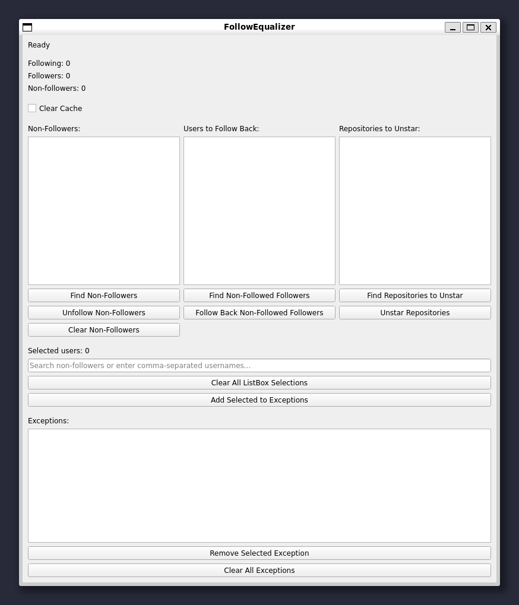
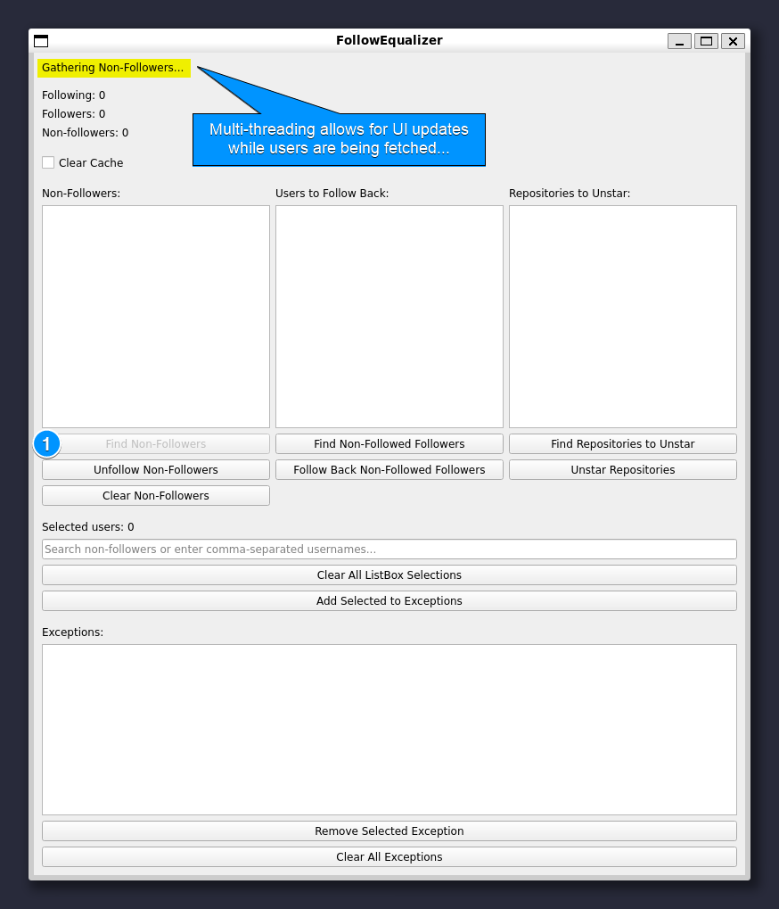
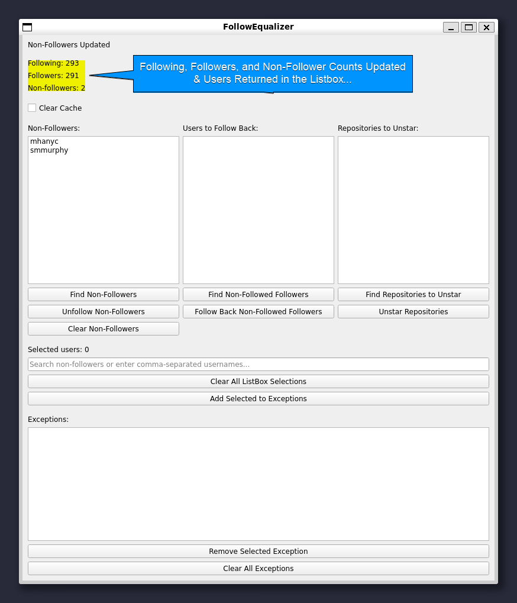
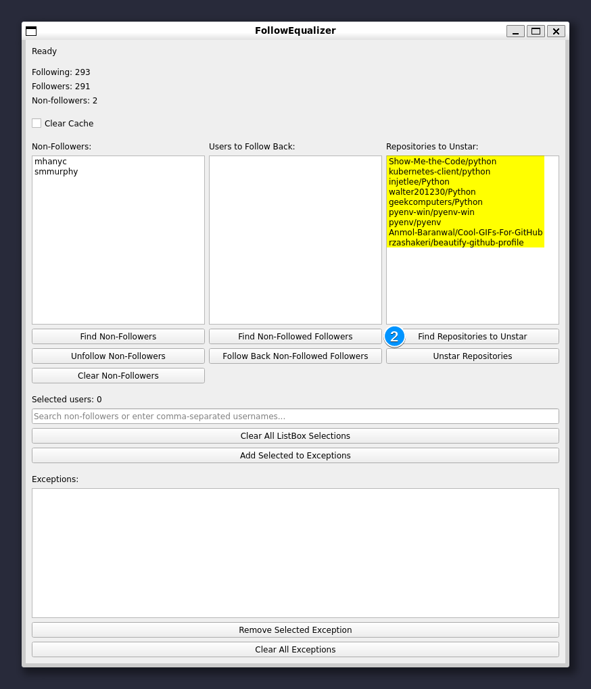
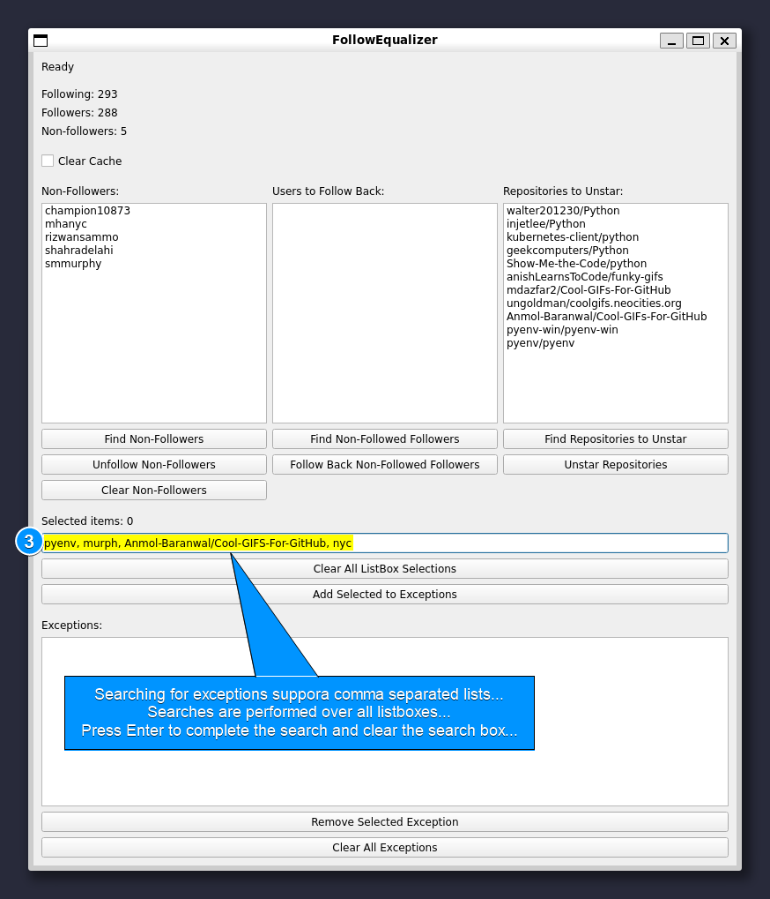
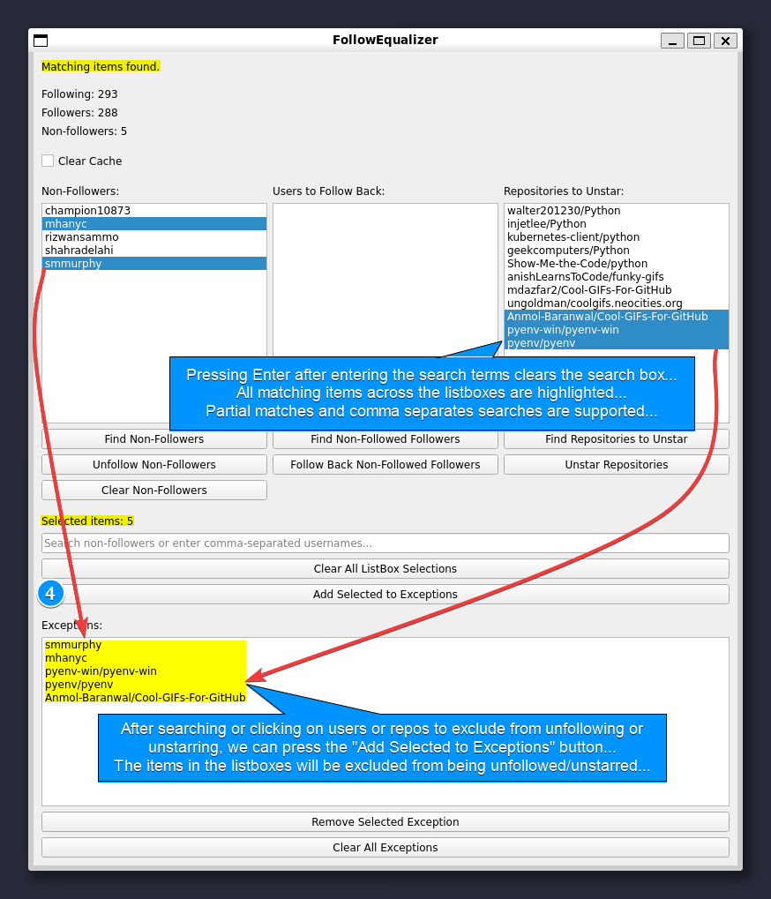
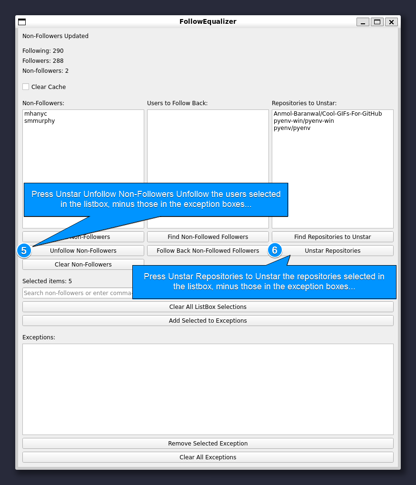
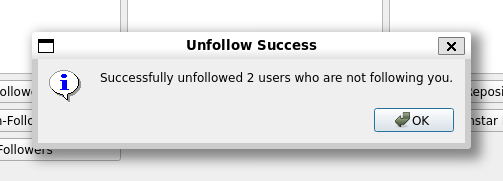

# FollowEqualizer

**FollowEqualizer** is a GitHub management tool that helps users efficiently manage their followers, repositories, and starred topics. It supports the following operations:

- Find non-followers (those you follow but who are not following you back)
- Unfollow non-followers
- Follow back users who follow you but whom you are not following
- Unstar repositories and starred topics
- Exclude specific users or repositories from actions (via exceptions)
- Multi-threaded operations for non-blocking UI updates
- Cache to improve performance on repeated operations

## **Getting Started**

Upon launching FollowEqualizer, you will see a blank GUI like the one below. This is where all the actions and results will appear once you begin interacting with the tool.



To get started:
1. Click "Find Non-Followers" to gather the list of users you follow who don't follow you back.
2. Use "Find Non-Followed Followers" to find those who follow you but aren't followed by you.
3. Click "Find Repositories to Unstar" to gather a list of starred repositories.
4. Add selected users or repositories to the exceptions list to avoid any unwanted actions.


## Features

### 1. **Multi-threading**
FollowEqualizer utilizes multi-threading to ensure a smooth user interface experience even when performing long-running API operations. For example, fetching a list of non-followers or starred repositories is done in separate threads, allowing the UI to remain responsive.

#### Example: Fetching Non-Followers



- During fetching, the UI stays responsive and updates with a message.
- Once the non-followers are fetched, the list and counters are updated.

#### Example: Non-Followers Returned



- After fetching, the non-followers are listed along with updated follower counts.

### 2. **Managing Starred Repositories**
The tool allows users to find and unstar repositories. It retrieves starred repositories and topics (if available), displaying them in a list.

#### Example: Finding Repositories to Unstar



- Users can select repositories they wish to unstar.

### 3. **Comma-separated Search**
FollowEqualizer supports a powerful search functionality that accepts comma-separated values for matching across all list boxes.

#### Example: Searching for Exceptions



- Matching users and repositories are highlighted in the lists when a search term is entered.

### 4. **Exception Management**
FollowEqualizer supports adding exceptions. Users and repositories in the exception list are excluded from the unfollow or unstar actions.

#### Example: Adding Exceptions



- You can select multiple items (users, repos) and add them to exceptions.

### 5. **Batch Actions**
You can unfollow multiple non-followers or unstar repositories/topics in bulk, with respect to the exception list.


#### Example: Performing Unfollow and Unstar Actions



- After specifying exceptions, bulk actions are performed on all the other items.

#### Example: Unfollow Success Message




- A confirmation message appears after a successful operation.

### 6. **Clear Cache**
The tool has an option to clear cached follower and repository data, ensuring the latest information is fetched from GitHub when needed.

### 7. **Caching**
FollowEqualizer caches certain API data like the list of followers and following users to avoid unnecessary calls and reduce latency. If you want to refresh the data, simply enable the "Clear Cache" checkbox before initiating a fetch operation.

## How It Works

The tool leverages the GitHub API to retrieve and manage data. Some key functionalities:

- **Multi-threading**: All major actions are performed on separate threads so that the user interface remains responsive. For instance, fetching followers, repositories, and topics doesn't block the main application window.

- **Cache**: The data retrieved from the GitHub API is cached by default to minimize repeated requests. However, if you want to refresh the data, use the "Clear Cache" option.

## Setup and Installation

### Prerequisites
- [Python 3.10.0](https://www.python.org/downloads/release/python-3100/)
- [PyQt5](https://pypi.org/project/PyQt5/)
- [PyGithub](https://pypi.org/project/PyGithub/)

### Steps

1. Clone the repository:
   ```bash
   git clone https://github.com/sminerport/FollowEqualizer.git
   ```

2. Install dependencies:
   ```bash
   pip install -r requirements.txt
   ```

3. Set up your GitHub token:
   - Store your GitHub token in a `.env` file.
   - Example `.env` file:
     ```
     GITHUB_TOKEN=your_github_token_here
     ```

4. Run the application:
   ```bash
   python src/main.py
   ```

## Usage

1. **Find Non-Followers**: Press the "Find Non-Followers" button to get a list of users you follow but who are not following you back.
2. **Unfollow Non-Followers**: Use this option to unfollow non-followers. Exceptions can be applied to exclude specific users.
3. **Follow Back Non-Followed Followers**: Press this button to automatically follow back users who follow you but whom you are not following.
4. **Find Repositories to Unstar**: Press the button to retrieve a list of starred repositories. You can then choose to unstar them.
5. **Add to Exceptions**: Use this to add selected users or repositories to an exception list, preventing them from being unfollowed or unstarred.
